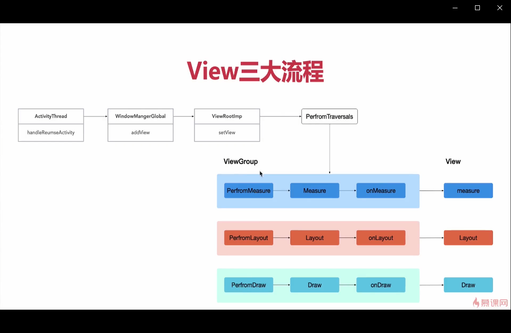

# View 树的测绘流程分析

View的测绘流程一直是面试重点，首先我们提出问题。

1、触发View三大流程的入口在哪里

2、onCreate,onResume中为什么获取不到View的宽高

3、onCreate中使用View.post为什么可以获取到宽高

4、子线程更新UI真的不行吗

由源码得出下图



通过阅读源码，我们得知整个View的绘制在handleResumeActivity里进行触发

```
    public void handleResumeActivity(IBinder token, boolean finalStateRequest, boolean isForward,
            String reason) {

        // ...
        if (r.window == null && !a.mFinished && willBeVisible) {
            r.window = r.activity.getWindow();
            View decor = r.window.getDecorView();
            decor.setVisibility(View.INVISIBLE);
            ViewManager wm = a.getWindowManager();
            WindowManager.LayoutParams l = r.window.getAttributes();
            a.mDecor = decor;
            // ...
            if (a.mVisibleFromClient) {
                if (!a.mWindowAdded) {
                    a.mWindowAdded = true;
                    //此处用于添加DecorView，wm 是 WindowManagerImpl
                    wm.addView(decor, l);
                } else {
                  // ...
                }
            }

            // If the window has already been added, but during resume
            // we started another activity, then don't yet make the
            // window visible.
        } else if (!willBeVisible) {
            if (localLOGV) Slog.v(TAG, "Launch " + r + " mStartedActivity set");
            r.hideForNow = true;
        }
        // ...

    }
```
注意，此处的decorview中所包含的View是在我们熟悉的onCreate生命周期中的setContentView()传入的。

继续进入addView()。这个方法的实现在WindowmanagerImpl

```
    public void addView(@NonNull View view, @NonNull ViewGroup.LayoutParams params) {
        applyDefaultToken(params);
        mGlobal.addView(view, params, mContext.getDisplay(), mParentWindow);
    }

```
此处继续调用addView()。此处是WindowManagerGlobal的addView()

```
 public void addView(View view, ViewGroup.LayoutParams params,
            Display display, Window parentWindow) {
        ViewRootImpl root;
        View panelParentView = null;

        synchronized (mLock) {
            // 十分重要的ViewRootImpl类在此处创建
            root = new ViewRootImpl(view.getContext(), display);

            view.setLayoutParams(wparams);

            mViews.add(view);
            mRoots.add(root);
            mParams.add(wparams);

            // do this last because it fires off messages to start doing things
            try {
                //将View set到WindowManagerImpl中
                root.setView(view, wparams, panelParentView);
            } catch (RuntimeException e) {
            }
        }
    }

```
最后一步

```
 public void setView(View view, WindowManager.LayoutParams attrs, View panelParentView) {
      requestLayout();
      //此方法的调用标志着View的绘制的开始
    }
```
