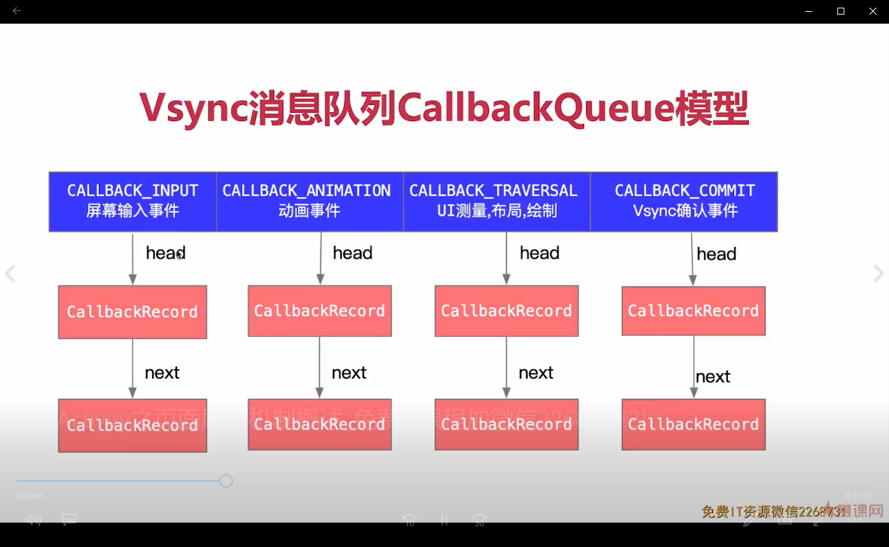

# View 树的测绘流程分析

View的测绘流程一直是面试重点，首先我们提出问题。

1、触发View三大流程的入口在哪里

2、onCreate,onResume中为什么获取不到View的宽高

3、onCreate中使用View.post为什么可以获取到宽高

4、子线程更新UI真的不行吗

由源码得出下图


## 第一阶段 装弹 准备好VIew并送到指定地方

通过阅读源码，我们得知整个View的绘制在handleResumeActivity里进行触发

```
    public void handleResumeActivity(IBinder token, boolean finalStateRequest, boolean isForward,
            String reason) {

        // ...
        if (r.window == null && !a.mFinished && willBeVisible) {
            r.window = r.activity.getWindow();
            View decor = r.window.getDecorView();
            decor.setVisibility(View.INVISIBLE);
            ViewManager wm = a.getWindowManager();
            WindowManager.LayoutParams l = r.window.getAttributes();
            a.mDecor = decor;
            // ...
            if (a.mVisibleFromClient) {
                if (!a.mWindowAdded) {
                    a.mWindowAdded = true;
                    //此处用于添加DecorView，wm 是 WindowManagerImpl
                    wm.addView(decor, l);
                } else {
                  // ...
                }
            }

            // If the window has already been added, but during resume
            // we started another activity, then don't yet make the
            // window visible.
        } else if (!willBeVisible) {
            if (localLOGV) Slog.v(TAG, "Launch " + r + " mStartedActivity set");
            r.hideForNow = true;
        }
        // ...

    }
```
注意，此处的decorview中所包含的View是在我们熟悉的onCreate生命周期中的setContentView()传入的。

继续进入addView()。这个方法的实现在WindowmanagerImpl

```
    public void addView(@NonNull View view, @NonNull ViewGroup.LayoutParams params) {
        applyDefaultToken(params);
        mGlobal.addView(view, params, mContext.getDisplay(), mParentWindow);
    }

```
此处继续调用addView()。此处是WindowManagerGlobal的addView()

```
 public void addView(View view, ViewGroup.LayoutParams params,
            Display display, Window parentWindow) {
        ViewRootImpl root;
        View panelParentView = null;

        synchronized (mLock) {
            // 十分重要的ViewRootImpl类在此处创建
            root = new ViewRootImpl(view.getContext(), display);

            view.setLayoutParams(wparams);

            mViews.add(view);
            mRoots.add(root);
            mParams.add(wparams);

            // do this last because it fires off messages to start doing things
            try {
                //将View set到WindowManagerImpl中
                root.setView(view, wparams, panelParentView);
            } catch (RuntimeException e) {
            }
        }
    }

```
最后一步调用ViewRootImpl中的setView

```
 public void setView(View view, WindowManager.LayoutParams attrs, View panelParentView) {
     ...
      requestLayout();
      //此方法的调用标志着View的绘制的开始，VIew到这里也就到了需要的地方
       // 这里的 view 是 DecorView
      view.assignParent(this);
       
    }
```

分析到这里我们就得出了我们第一个问题的答案View三大流程的入口

## ViewRootImpl 浅析

ViewRootImpl 是一个很重要的类，具备以下重要职能。而它的创建时机我们可以从之前的流程中看到是在ActivityThread.handleResumeActivity里

1、WindowSession将Window添加到WindowManagerService

2、页面View树的顶层节点，关联Window和View。但本身不是View

3、Choreographer 接收Vsync同步信号触发View的三大流程

4、WindowInputEventReceiver 接收屏幕输入事件，分发手势。

5、接收Vsync同步信号，触发View的动画重绘


## 第二阶段 上膛发射 开始View的绘制

进入requestLayout方法。这里的逻辑很简单

```
    public void requestLayout() {
        if (!mHandlingLayoutInLayoutRequest) {
            //进行线程检查
            checkThread();
            mLayoutRequested = true;
            scheduleTraversals();
        }
    }

    void checkThread() {
        if (mThread != Thread.currentThread()) {
            throw new CalledFromWrongThreadException(
                    "Only the original thread that created a view hierarchy can touch its views.");
        }
    }

    void scheduleTraversals() {
        if (!mTraversalScheduled) {
            mTraversalScheduled = true;
            mTraversalBarrier = mHandler.getLooper().getQueue().postSyncBarrier();
            //发送屏障消息
            mChoreographer.postCallback(
                    Choreographer.CALLBACK_TRAVERSAL, mTraversalRunnable, null);
            //发送异步消息
            if (!mUnbufferedInputDispatch) {
                scheduleConsumeBatchedInput();
            }
            notifyRendererOfFramePending();
            pokeDrawLockIfNeeded();
        }
    }
```

可以看到在进行简单的线程检查后就开始调用scheduleTraversals();在scheduleTraversals()方法中我们发送了一个 __屏障消息__。（此处屏障消息的作用在于让异步消息优先执行。从而使得ViewRootImpl中的UI测量，布局，绘制尽早执行）

我们继续看mTraversalRunnable，在它的run方法中调用了doTraversal()

```
void doTraversal() {
        if (mTraversalScheduled) {
            mTraversalScheduled = false;
            //移除消息屏障
            mHandler.getLooper().getQueue().removeSyncBarrier(mTraversalBarrier);

            if (mProfile) {
                Debug.startMethodTracing("ViewAncestor");
            }
            //关键方法
            performTraversals();

            if (mProfile) {
                Debug.stopMethodTracing();
                mProfile = false;
            }
        }
    }
```
这个doTraversal()的核心就是我们的performTraversals()。这个方法的代码巨多。简单的介绍作用就是，根据当前界面的View树，判断有没有View发生变化，需不需要重新布局测绘。而我们在分析View初次绘制流程时需要关注的三个核心方法如下

```
performMeasure(childWidthMeasureSpec, childHeightMeasureSpec);

performLayout(lp, mWidth, mHeight);

performDraw();
```

到了这里就开始逐步递归调用我们View的Measure，Layout，Draw方法完成View的绘制

## 扩展 Choreographer 。

以上的内容是一次绘制的流程，但我们知道页面不是只绘制一次就结束了的。很多时候我们是需要刷新多次。而我们每次刷新是由Choreographer进行post的。

Choreographer 的类头描述为Coordinates the timing of animations, input and drawing....（协调动画、输入和绘图的时间。接收时间脉冲过滤一帧内的重复请求。）

```
private Choreographer(Looper looper, int vsyncSource) {
        mLooper = looper;
        mHandler = new FrameHandler(looper);
        mDisplayEventReceiver = USE_VSYNC
                ? new FrameDisplayEventReceiver(looper, vsyncSource)
                : null;
                //监听来自native层的vsync信号
        mLastFrameTimeNanos = Long.MIN_VALUE;

        mFrameIntervalNanos = (long)(1000000000 / getRefreshRate());

        mCallbackQueues = new CallbackQueue[CALLBACK_LAST + 1];
        for (int i = 0; i <= CALLBACK_LAST; i++) {
            mCallbackQueues[i] = new CallbackQueue();
        }
        //存储callback回调例如，例如我们绘制发送的CALLBACK_TRAVERSAL
       
        setFPSDivisor(SystemProperties.getInt(ThreadedRenderer.DEBUG_FPS_DIVISOR, 1));
    }
```
构造函数很简单，里面值得注意的是我们的callbackqueue。其模型如下：



接下来我们看到这个类暴露给外部调用的两个重要方法并一步步解读

```
    public void postFrameCallback(FrameCallback callback) {
        postFrameCallbackDelayed(callback, 0);
    }

    public void postFrameCallbackDelayed(FrameCallback callback, long delayMillis) {
        if (callback == null) {
            throw new IllegalArgumentException("callback must not be null");
        }
    }


    postCallbackDelayedInternal(CALLBACK_ANIMATION,
                callback, FRAME_CALLBACK_TOKEN, delayMillis);
    }

        private void postCallbackDelayedInternal(int callbackType,
            Object action, Object token, long delayMillis) {
        if (DEBUG_FRAMES) {
            Log.d(TAG, "PostCallback: type=" + callbackType
                    + ", action=" + action + ", token=" + token
                    + ", delayMillis=" + delayMillis);
        }

        synchronized (mLock) {
            final long now = SystemClock.uptimeMillis();
            final long dueTime = now + delayMillis;

            //根据type取队列，再在队列中添加我们这次的callback
            mCallbackQueues[callbackType].addCallbackLocked(dueTime, action, token);

            if (dueTime <= now) {
                //立刻执行
                scheduleFrameLocked(now);
            } else {
                //等到轮询的时候再执行
                Message msg = mHandler.obtainMessage(MSG_DO_SCHEDULE_CALLBACK, action);
                msg.arg1 = callbackType;
                msg.setAsynchronous(true);
                mHandler.sendMessageAtTime(msg, dueTime);
            }
        }
    }


    private void scheduleFrameLocked(long now) {
        if (!mFrameScheduled) {
            mFrameScheduled = true;
            //4.1后默认是true
            if (USE_VSYNC) {
                if (DEBUG_FRAMES) {
                    Log.d(TAG, "Scheduling next frame on vsync.");
                }

                //线程判断
                if (isRunningOnLooperThreadLocked()) {
                    scheduleVsyncLocked();
                } else {
                    Message msg = mHandler.obtainMessage(MSG_DO_SCHEDULE_VSYNC);
                    msg.setAsynchronous(true);
                    mHandler.sendMessageAtFrontOfQueue(msg);
                }
            } else {
                final long nextFrameTime = Math.max(
                        mLastFrameTimeNanos / TimeUtils.NANOS_PER_MS + sFrameDelay, now);
                if (DEBUG_FRAMES) {
                    Log.d(TAG, "Scheduling next frame in " + (nextFrameTime - now) + " ms.");
                }
                Message msg = mHandler.obtainMessage(MSG_DO_FRAME);
                msg.setAsynchronous(true);
                mHandler.sendMessageAtTime(msg, nextFrameTime);
            }
        }
    }

    private void scheduleVsyncLocked() {
        //根据构造函数里创建的mDisplayEventReceiver去订阅新的硬件信号
        mDisplayEventReceiver.scheduleVsync();
    }

    //当有信号到达时会回调onVsync()

    public void onVsync(long timestampNanos, int builtInDisplayId, int frame) {

            ...

            mTimestampNanos = timestampNanos;
            mFrame = frame;
            Message msg = Message.obtain(mHandler, this);
            msg.setAsynchronous(true);
            //发送异步消息,由于消息包裹了this，本身这里是一个runnnable，所以消息发出去后调用的是run（）方法
            mHandler.sendMessageAtTime(msg, timestampNanos / TimeUtils.NANOS_PER_MS);
        }

    @Override
    public void run() {
            mHavePendingVsync = false;
            doFrame(mTimestampNanos, mFrame);
        }

         void doFrame(long frameTimeNanos, int frame) {
        final long startNanos;
        synchronized (mLock) {
            ...

            long intendedFrameTimeNanos = frameTimeNanos;
            startNanos = System.nanoTime();
            final long jitterNanos = startNanos - frameTimeNanos;
            if (jitterNanos >= mFrameIntervalNanos) {
                final long skippedFrames = jitterNanos / mFrameIntervalNanos;
                if (skippedFrames >= SKIPPED_FRAME_WARNING_LIMIT) {
                    //掉帧大于30会输出本条日志
                    Log.i(TAG, "Skipped " + skippedFrames + " frames!  "
                            + "The application may be doing too much work on its main thread.");
                }
                final long lastFrameOffset = jitterNanos % mFrameIntervalNanos;
                if (DEBUG_JANK) {
                    Log.d(TAG, "Missed vsync by " + (jitterNanos * 0.000001f) + " ms "
                            + "which is more than the frame interval of "
                            + (mFrameIntervalNanos * 0.000001f) + " ms!  "
                            + "Skipping " + skippedFrames + " frames and setting frame "
                            + "time to " + (lastFrameOffset * 0.000001f) + " ms in the past.");
                }
                frameTimeNanos = startNanos - lastFrameOffset;
            }

            ....

        try {
            Trace.traceBegin(Trace.TRACE_TAG_VIEW, "Choreographer#doFrame");
            AnimationUtils.lockAnimationClock(frameTimeNanos / TimeUtils.NANOS_PER_MS);

            mFrameInfo.markInputHandlingStart();
            //处理我们callback
            doCallbacks(Choreographer.CALLBACK_INPUT, frameTimeNanos);

            mFrameInfo.markAnimationsStart();
            doCallbacks(Choreographer.CALLBACK_ANIMATION, frameTimeNanos);

            mFrameInfo.markPerformTraversalsStart();
            doCallbacks(Choreographer.CALLBACK_TRAVERSAL, frameTimeNanos);

            doCallbacks(Choreographer.CALLBACK_COMMIT, frameTimeNanos);
        } finally {
            AnimationUtils.unlockAnimationClock();
            Trace.traceEnd(Trace.TRACE_TAG_VIEW);
        }

       ...
    }


void doCallbacks(int callbackType, long frameTimeNanos) {
        CallbackRecord callbacks;
        synchronized (mLock) {
            
            final long now = System.nanoTime();
            //取出我们的队头
            callbacks = mCallbackQueues[callbackType].extractDueCallbacksLocked(
                    now / TimeUtils.NANOS_PER_MS);
            if (callbacks == null) {
                return;
            }
            mCallbacksRunning = true;

    
        ...


        try {
            Trace.traceBegin(Trace.TRACE_TAG_VIEW, CALLBACK_TRACE_TITLES[callbackType]);
            for (CallbackRecord c = callbacks; c != null; c = c.next) {
                if (DEBUG_FRAMES) {
                    Log.d(TAG, "RunCallback: type=" + callbackType
                            + ", action=" + c.action + ", token=" + c.token
                            + ", latencyMillis=" + (SystemClock.uptimeMillis() - c.dueTime));
                }
                //执行我们的callback
                c.run(frameTimeNanos);
            }
        } finally {
            synchronized (mLock) {
                mCallbacksRunning = false;
                do {
                    final CallbackRecord next = callbacks.next;
                    recycleCallbackLocked(callbacks);
                    callbacks = next;
                } while (callbacks != null);
            }
            Trace.traceEnd(Trace.TRACE_TAG_VIEW);
        }
    }

```
至此，我们已经完成了接收信号源码流程阅读
