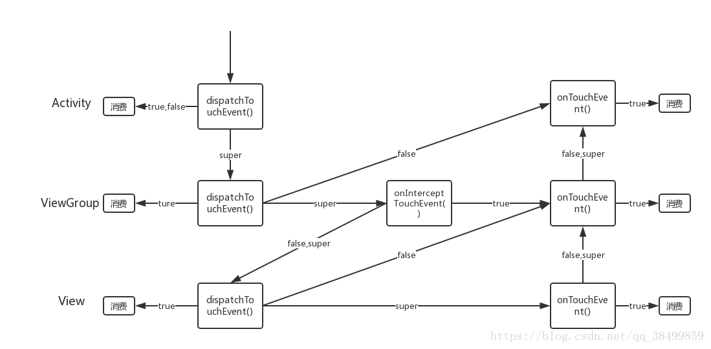

# 事件分发流程

## 分发谁？ MotionEvent！

在安卓的事件分发中，我们分发的是一个MotionEvent对象，每个对象包含一个动作，如ACTION_DOWN、ACTION_MOVE、ACTION_UP。代表着，按下、滑动、抬起。每当MotionEvent产生时，系统就需要将其分发到对应的View将其消费掉。

## 事件分发

事件分发涉及到了三个方法

- dispatchTouchEvent() 用于分发事件

- onInterceptTouchEvent() 用于拦截事件

- onTouchEvent() 用于消费事件


注意View是没有onInterceptTouchEvent方法的，因为View没有子View，一般是ViewGroup会有这个方法。

三者关系的经典伪代码

```
//在一个ViewGroup中
public boolen dispatchTouchEvent（）{
	boolen consume = false；
	if(onInterceptTouchEvent){  
		consume = onTouchEvent(ev); //如果被拦截，调用当前viewGroup的onTouchEvent
	}else{
		consume = child.dispatchTouchEvent(); //如果未被拦截，调用当前的子view的dispatchTouchEvent，即事件传递给子view
	}
	return consume;
}

```

再看看从网上搞来了一张图


 
图分为三层，从上到下分别为Activity、ViewGroup、View。

箭头中间的值表示返回值

由图可以看到

1、如果整个事件不去改写和中断，那么整个事件就是一个类U型图。先从Activity从上到下走到View，再由View的从下到上走onTouchEvent到Activity

2、如果dispatchTouchEvent 和onTouchEvent 一旦返回了true，则事件不会继续向下分发。

3、如果dispatchTouchEvent 和onTouchEvent返回了false 则事件都会回传给父控件的onTouchEvent

4、onInterceptTouchEvent 表示拦截，在ViewGroup进行分发是，会询问拦截器是否需要拦截。

____注意:以上分析只针对Down事件，move事件需要另说，move事件和down事件的流程并不是一致的____

简单说来：当前一个事件返回为true时，才会收到move和up事件。并且这些事件会传递到消费了这个事件的view上。


## 源码分析

好了，有了以上的基本铺垫就可以开始源码分析了。

____Activity的事件分发源码____

```
 
//事件分发
public boolean dispatchTouchEvent(MotionEvent ev) {
    if (ev.getAction() == MotionEvent.ACTION_DOWN) {
        //空方法
        onUserInteraction();
    }
    if (getWindow().superDispatchTouchEvent(ev)) {
        //这里调用的就是PhoneWindow.superDispatchTouchEvent
        return true;
    }
    //onTouchEvent()方法默认返回false
    return onTouchEvent(ev);
}

    /**
     * PhoneWindow.superDispatchTouchEvent
     * 说明1:
     *      1.getWindow()获得是Window的抽象类
     *      2.而window的唯一实现就是PhoneWindow
     */
    public boolean superDispatchTouchEvent(MotionEvent event) {

        //Decor即是DecorView，所以honeWindow将事件传递给了DecorView
        return mDecor.superDispatchTouchEvent(event);
    }

    public boolean onTouchEvent(MotionEvent event) {
        //如果子view消费当前事件时
        if (mWindow.shouldCloseOnTouch(this, event)) {
            finish();
            return true;
        }

        return false;
    }

    public boolean shouldCloseOnTouch(Context context, MotionEvent event) {
        if (mCloseOnTouchOutside && event.getAction() == MotionEvent.ACTION_DOWN
                && isOutOfBounds(context, event) && peekDecorView() != null) {
        // 返回true：事件在边界外，即 事件在这里就消费了
            return true;
        }
        return false;
        
        // 返回false：未消费（默认）
    }

```

____ViewGroup事件分发源码____

dispatchTouchEvent源码，有点长。该注释的地方我都注释了一下，需要耐心看

```
   @Override
    public boolean dispatchTouchEvent(MotionEvent ev) {
        if (mInputEventConsistencyVerifier != null) {
            mInputEventConsistencyVerifier.onTouchEvent(ev, 1);
        }

        boolean handled = false;
        if (onFilterTouchEventForSecurity(ev)) { // view没有被遮罩，一般都成立
            final int action = ev.getAction();
            final int actionMasked = action & MotionEvent.ACTION_MASK;

            // 处理第一个down事件
            if (actionMasked == MotionEvent.ACTION_DOWN) { // 一堆touch事件（从按下到松手）中的第一个down事件
                cancelAndClearTouchTargets(ev);
                resetTouchState(); 
                //reset所有相关的状态
            }
            final boolean intercepted; // 检查是否要拦截
        
            if (actionMasked == MotionEvent.ACTION_DOWN // down事件
                    || mFirstTouchTarget != null) { // 或者之前的某次事件已经经由此ViewGroup派发给children后被处理掉了

                //FLAG_DISALLOW_INTERCEPT设置后，ViewGroup无法栏除ACTION_DOWN之外的其他点击直接。
                //原因:在ViewGroup分发事件时，如果是ACTION_DOWN,会重置这个标志位
                //设置方法: requestDisallowInterceptTouchEvent
                //
                final boolean disallowIntercept = (mGroupFlags & FLAG_DISALLOW_INTERCEPT) != 0;
                if (!disallowIntercept) { // 只有允许拦截才执行onInterceptTouchEvent方法
                    intercepted = onInterceptTouchEvent(ev); // 默认返回false，不拦截
                    ev.setAction(action); // restore action in case it was changed
                } else {
                    intercepted = false; // 不允许拦截的话，直接设为false
                }
            } else {
                // actionMasked != ACTION_DOWN && mFirstTouchTarget == null
                // 第一次的down事件没有被此ViewGroup的children处理掉（要么是它们自己不处理，要么是ViewGroup从一
                // 开始的down事件就开始拦截），则接下来的所有事件
                // 也没它们的份，即不处理down事件的话，那表示你对后面接下来的事件也不感兴趣
                intercepted = true; // 这种情况下设置ViewGroup拦截接下来的事件
            }

            //检查CANCEL事件
            final boolean canceled = resetCancelNextUpFlag(this)
                    || actionMasked == MotionEvent.ACTION_CANCEL; // 此touch事件是否取消了

            final boolean split = (mGroupFlags & FLAG_SPLIT_MOTION_EVENTS) != 0;
            TouchTarget newTouchTarget = null; // 接下来ViewGroup判断要将此touch事件交给谁处理
            boolean alreadyDispatchedToNewTouchTarget = false;
            if (!canceled && !intercepted) { // 没取消也不拦截，即是个有效的touch事件
                if (actionMasked == MotionEvent.ACTION_DOWN // 第一个手指down
                        || (split && actionMasked == MotionEvent.ACTION_POINTER_DOWN) // 接下来的手指down
                        || actionMasked == MotionEvent.ACTION_HOVER_MOVE) {
                    final int actionIndex = ev.getActionIndex(); // always 0 for down
                    final int idBitsToAssign = split ? 1 << ev.getPointerId(actionIndex)
                            : TouchTarget.ALL_POINTER_IDS;

                   
                    removePointersFromTouchTargets(idBitsToAssign);

                    final int childrenCount = mChildrenCount;
                    if (newTouchTarget == null && childrenCount != 0) { // 基本都成立
                        final float x = ev.getX(actionIndex);
                        final float y = ev.getY(actionIndex);
                       
                        final View[] children = mChildren;

                        final boolean customOrder = isChildrenDrawingOrderEnabled();
                        // 从最后一个向第一个找,这里就是为什么我们点击事件是最上层的View最先响应了
                        for (int i = childrenCount - 1; i >= 0; i--) {
                            final int childIndex = customOrder ?
                                    getChildDrawingOrder(childrenCount, i) : i;
                            final View child = children[childIndex];

                            // 判断view是否能接收事件且在View边界中
                            if (!canViewReceivePointerEvents(child)
                                    || !isTransformedTouchPointInView(x, y, child, null)) {
                                continue; // 不满足这2个条件直接跳过，看下一个child
                            }

                            
                            newTouchTarget = getTouchTarget(child);// 查找child对应的TouchTarget
                            if (newTouchTarget != null) { // 比如在同一个child上按下了多跟手指
                                //子View已经在自己的范围内得到了触摸。
                                //除了它正在处理的那个，给它一个新的指针。
                                newTouchTarget.pointerIdBits |= idBitsToAssign;
                                break; // newTouchTarget已经有了，跳出for循环
                            }

                            resetCancelNextUpFlag(child);
                            // 将此事件交给child处理
                            // 有这种情况，一个手指按在了child1上，另一个手指按在了child2上，以此类推
                            // 这样TouchTarget的链就形成了
                            //进行子View的分发
                            if (dispatchTransformedTouchEvent(ev, false, child, idBitsToAssign)) {
                                // Child wants to receive touch within its bounds.
                                mLastTouchDownTime = ev.getDownTime();
                                mLastTouchDownIndex = childIndex;
                                mLastTouchDownX = ev.getX();
                                mLastTouchDownY = ev.getY();
                                // 如果处理掉了的话，将此child添加到touch链的头部
                                // 注意这个方法内部会更新 mFirstTouchTarget
                                newTouchTarget = addTouchTarget(child, idBitsToAssign);
                                alreadyDispatchedToNewTouchTarget = true; // down或pointer_down事件已经被处理了
                                break; // 可以退出for循环了。。。
                            }
                        }
                    }

                    // 本次没找到newTouchTarget但之前的mFirstTouchTarget已经有了
                    if (newTouchTarget == null && mFirstTouchTarget != null) {
                        // Did not find a child to receive the event.
                        // Assign the pointer to the least recently added target.
                        newTouchTarget = mFirstTouchTarget;
                        while (newTouchTarget.next != null) {
                            newTouchTarget = newTouchTarget.next;
                        }
                        // while结束后，newTouchTarget指向了最初的TouchTarget
                        newTouchTarget.pointerIdBits |= idBitsToAssign;
                    }
                }
            }


            // 非down事件直接从这里开始处理，不会走上面的一大堆寻找TouchTarget的逻辑
            // Dispatch to touch targets.
            if (mFirstTouchTarget == null) {
                // 没有children处理则派发给自己处理
            
                handled = dispatchTransformedTouchEvent(ev, canceled, null,
                        TouchTarget.ALL_POINTER_IDS);
            } else {
               
                TouchTarget predecessor = null;
                TouchTarget target = mFirstTouchTarget;
                while (target != null) { // 遍历TouchTarget形成的链表
                    final TouchTarget next = target.next;
                    if (alreadyDispatchedToNewTouchTarget && target == newTouchTarget) {
                        handled = true; // 已经处理过的不再让其处理事件
                    } else {
                        // 取消child标记
                        final boolean cancelChild = resetCancelNextUpFlag(target.child)
                                || intercepted;
                        // 如果ViewGroup从半路拦截了touch事件则给touch链上的child发送cancel事件
                        // 如果cancelChild为true的话
                        if (dispatchTransformedTouchEvent(ev, cancelChild,
                                target.child, target.pointerIdBits)) {
                            handled = true; // TouchTarget链中任意一个处理了则设置handled为true
                        }
                        if (cancelChild) { // 如果是cancelChild的话，则回收此target节点
                            if (predecessor == null) {
                                mFirstTouchTarget = next;
                            } else {
                                predecessor.next = next; // 相当于从链表中删除一个节点
                            }
                            target.recycle(); // 回收它
                            target = next;
                            continue;
                        }
                    }
                    predecessor = target; // 访问下一个节点
                    target = next;
                }
            }

          
            if (canceled
                    || actionMasked == MotionEvent.ACTION_UP
                    || actionMasked == MotionEvent.ACTION_HOVER_MOVE) {
                // 取消或up事件时resetTouchState
                resetTouchState();
            } else if (split && actionMasked == MotionEvent.ACTION_POINTER_UP) {
                // 当某个手指抬起时，将其相关的信息移除
                final int actionIndex = ev.getActionIndex();
                final int idBitsToRemove = 1 << ev.getPointerId(actionIndex);
                removePointersFromTouchTargets(idBitsToRemove);
            }
        }

        if (!handled && mInputEventConsistencyVerifier != null) {
            mInputEventConsistencyVerifier.onUnhandledEvent(ev, 1);
        }
        return handled; // 返回处理的结果
    }

    //觉得上面一串有点啰嗦下面有简单版的

    @Override
public boolean dispatchTouchEvent(MotionEvent ev) {
    ...
    //默认返回false
    boolean handled = false;
    
    //给方法决定是否拦截事件的分发
    onInterceptTouchEvent(ev);
    ...
    //默认情况下canceled和intercepted为false
    if (!canceled && !intercepted) {
        ...
        //该方法将事件传递给子View
        dispatchTransformedTouchEvent(ev, false, child, idBitsToAssign)) {
        ...        
    }
            
    return handled;
}


    //向子View分发事件
    private boolean dispatchTransformedTouchEvent(MotionEvent event, boolean cancel,
            View child, int desiredPointerIdBits) {
        final boolean handled;
        //仅分析核心代码
        if (child == null) {
        //调用父类的dispatchTouchEvent方法
            handled = super.dispatchTouchEvent(transformedEvent);
        } else {
	    //分发给子View的dispatchTouchEvent
            handled = child.dispatchTouchEvent(transformedEvent);
        }
        // Done.
        transformedEvent.recycle();
        return handled;
    }


```

onInterceptTouchEvent()源码

```
/** 
* ViewGroup.onInterceptTouchEvent() 
*    默认返回true
*  */

 public boolean onInterceptTouchEvent(MotionEvent ev) {
        if (ev.isFromSource(InputDevice.SOURCE_MOUSE)
                && ev.getAction() == MotionEvent.ACTION_DOWN
                && ev.isButtonPressed(MotionEvent.BUTTON_PRIMARY)
                && isOnScrollbarThumb(ev.getX(), ev.getY())) {
            //鼠标事件且点击了左键，正常手机操作不会出现这样情况，故返回false
            return true;
        }
        return false;
    }

```

____备注:ViewGroup是没有自己的事件处理方法的，其处理方法就是View的处理方法____

____View的事件分析源码（View没有事件拦截）____

```

    public boolean dispatchTouchEvent(MotionEvent event) {
        if (mInputEventConsistencyVerifier != null) {
            mInputEventConsistencyVerifier.onTouchEvent(event, 0);
        }

        if (onFilterTouchEventForSecurity(event)) { // 一般都成立
          

            //首先判断是否设置OnTouchListener,如果OnTouchListener中的onTouch方法中返回true，那么onTouchEvent就不会被调用，
            if (li != null && li.mOnTouchListener != null && (mViewFlags & ENABLED_MASK) == ENABLED
                    && li.mOnTouchListener.onTouch(this, event)) { // 先在ENABLED状态下尝试调用onTouch方法
                return true; // 如果被onTouch处理了，则直接返回true
            }
            // 从这里我们可以看出，当你既设置了OnTouchListener又设置了OnClickListener，那么当前者返回true的时候，
            // onTouchEvent没机会被调用，当然你的OnClickListener也就不会被触发；另外还有个区别就是onTouch里可以
            // 收到每次touch事件，而onClickListener只是在up事件到来时触发。
            if (onTouchEvent(event)) {
                return true;
            }
        }

        if (mInputEventConsistencyVerifier != null) {
            mInputEventConsistencyVerifier.onUnhandledEvent(event, 0);
        }
        return false; // 上面的都没处理，则返回false
    }


    public boolean onTouchEvent(MotionEvent event) { // View对touch事件的默认处理逻辑
        final int viewFlags = mViewFlags;

        if ((viewFlags & ENABLED_MASK) == DISABLED) { // DISABLED的状态下
            if (event.getAction() == MotionEvent.ACTION_UP && (mPrivateFlags & PFLAG_PRESSED) != 0) {
                setPressed(false); // 复原，如果之前是PRESSED状态
            }
            
            return (((viewFlags & CLICKABLE) == CLICKABLE || // CLICKABLE或LONG_CLICKABLE的view标记为对事件处理了，
                    (viewFlags & LONG_CLICKABLE) == LONG_CLICKABLE)); // 只不过是以do nothing的方式处理了。
        }

        if (mTouchDelegate != null) {
            if (mTouchDelegate.onTouchEvent(event)) { // 如果有TouchDelegate的话，优先交给它处理
                return true; // 处理了返回true，否则接着往下走
            }
        }

        if (((viewFlags & CLICKABLE) == CLICKABLE || // View能对touch事件响应的前提要么是CLICKABLE要么是LONG_CLICKABLE
                (viewFlags & LONG_CLICKABLE) == LONG_CLICKABLE)) {
            switch (event.getAction()) {
                case MotionEvent.ACTION_UP: // UP事件
                    // 如果外围有可以滚动的parent的话，当按下时会设置这个标志位
                    boolean prepressed = (mPrivateFlags & PFLAG_PREPRESSED) != 0;
                    if ((mPrivateFlags & PFLAG_PRESSED) != 0 || prepressed) { // 按下了或者预按下了
                        
                        boolean focusTaken = false;
                        // 尝试requestFocus()，并将focusToken设置为true
                        if (isFocusable() && isFocusableInTouchMode() && !isFocused()) {
                            focusTaken = requestFocus(); // 能进来这个if，一般都会返回true
                        }

                        if (prepressed) {
                            // 在前面down事件的时候我们延迟显示view的pressed状态
                            setPressed(true); // 直到up事件到来的时候才显示pressed状态
                        }

                        if (!mHasPerformedLongPress) { // 如果没有长按发生的话
                           
                            removeLongPressCallback(); // 移除长按callback

                            if (!focusTaken) { // 看到没，focusTaken是false才会进入下面的if语句
　　　　　　　　　　　　            // 也就是说在touch mode下，不take focus的view第一次点击的时候才会触发onClick事件
                                if (mPerformClick == null) {
                                    mPerformClick = new PerformClick();
                                }
                                if (!post(mPerformClick)) { 
                                    // 如果post失败了，则直接调用performClick()方法
                                    performClick(); // 这2行代码会触发onClickListener
                                }
                            }
                        }

                        if (mUnsetPressedState == null) {
                            mUnsetPressedState = new UnsetPressedState(); // unset按下状态的
                        }

                        if (prepressed) {
                            postDelayed(mUnsetPressedState,
                                    ViewConfiguration.getPressedStateDuration());
                        } else if (!post(mUnsetPressedState)) {
                            mUnsetPressedState.run();
                        }
                        removeTapCallback();
                    }
                    break;

                case MotionEvent.ACTION_DOWN: // DOWN事件
                    mHasPerformedLongPress = false;

                    if (performButtonActionOnTouchDown(event)) {
                        break;
                    }

                  
                    boolean isInScrollingContainer = isInScrollingContainer();

                    if (isInScrollingContainer) { // 如果是在可以滚动的container里面的话
                        mPrivateFlags |= PFLAG_PREPRESSED; // 设置PREPRESSED标志位
                        if (mPendingCheckForTap == null) {
                            mPendingCheckForTap = new CheckForTap();
                        } // 延迟pressed feedback
                        postDelayed(mPendingCheckForTap, ViewConfiguration.getTapTimeout());
                    } else {
                        setPressed(true); // 否则直接显示pressed feedback
                        checkForLongClick(0); // 并启动长按监测
                    }
                    break;

                case MotionEvent.ACTION_CANCEL: // 针对CANCEL事件的话，恢复各种状态，移除各种callback
                    setPressed(false);
                    removeTapCallback();
                    removeLongPressCallback();
                    break;

                case MotionEvent.ACTION_MOVE: // MOVE事件
                    final int x = (int) event.getX();
                    final int y = (int) event.getY();

                  
                    if (!pointInView(x, y, mTouchSlop)) { // 如果移动到view的边界之外了，
                        removeTapCallback(); // 则取消Tap callback，这样当你松手的时候onClick不会被触发
                        if ((mPrivateFlags & PFLAG_PRESSED) != 0) { // 当已经是按下状态的话
                            // Remove any future long press/tap checks
                            removeLongPressCallback(); // 移除长按callback

                            setPressed(false); // 恢复按下状态
                        }
                    }
                    break;
            }
            return true; // 最后返回true，表示对touch事件处理过了，消费了
        }

        return false; // 既不能单击也不能长按的View，返回false，表示不处理touch事件
    }


```