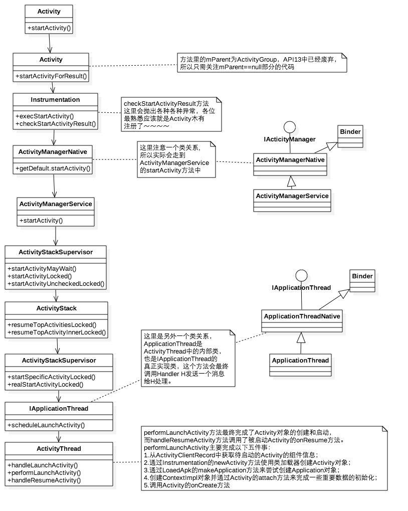
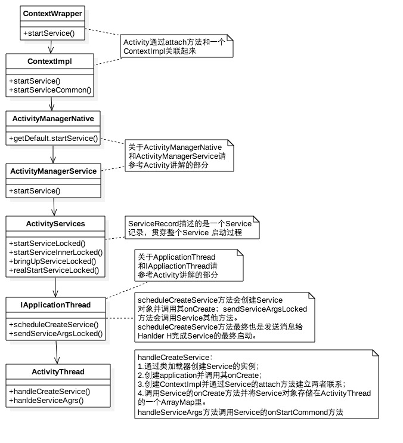
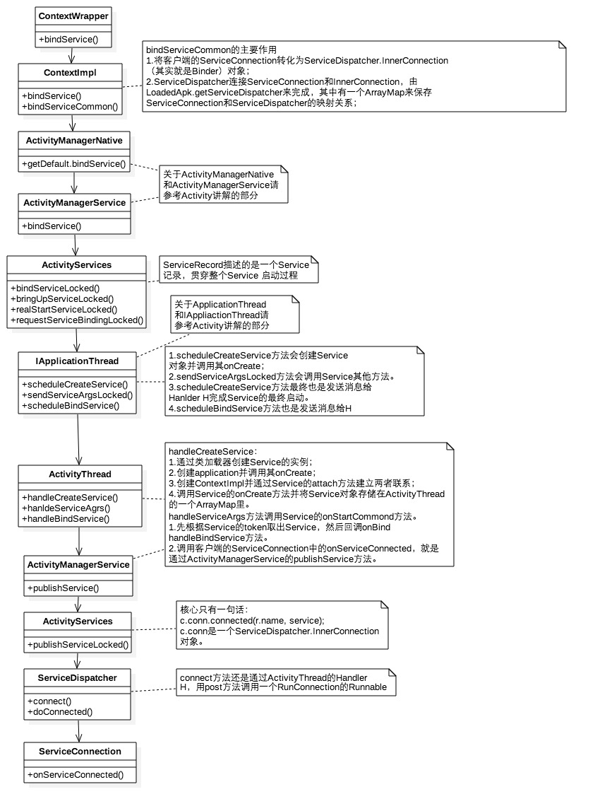
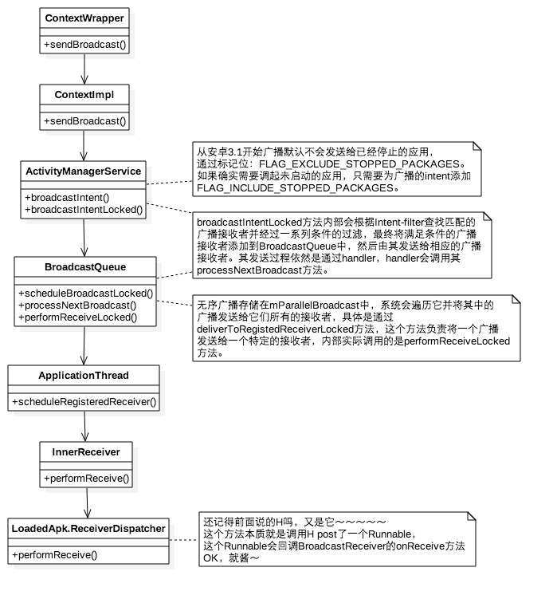

# 四大组件流程分析

## Activity启动流程分析

### 工作过程

Activity的启动流程如下所示

#### 备注

* ActivityManagerService、ApplicationThread都是Binder
* Application的创建也是通过Instrumentation来完成的，这个过程和Activity对象一样，都是通过类加载器实现。
* Activity的启动流程最终回到ApplicationThread中，通过ApplicationThread.scheduleLaunchActivity()发送消息交由Handler处理。
* Handler H对消息的处理会调用handleLaunchActivity()->performLaunchActivity()得以最终完成Activity的创建和启动。

## Service的启动流程分析

* start方式启动

* bind方式启动

归纳总结

* Service的流程整体上与Activity相差不多，中间经过了两次Binder通信

* ContextImpl是Context的具体实现，通过Activity.attach()和Activity建立关联。

* ActivityServices是一个辅助AMS进行Service管理的类。

* Service的最终启动过程与Activity相似，最终都是回到ApplicationThread中，通过ActivityThread中的handleCreateService和handleBindService完成Service的最终启动。

* 绑定Service的后续还有一个回调流程。这个需要AMS的中的publishService去完成。

## BroadcastReceiver启动流程

注册流程

* 静态注册： 安装时由PackageManagerService解析注册

* 动态注册流程

* 广播发送和接收过程的流程图

总结归纳

* 动态广播的最后会跨进程交给AMS，并把远程的Receiver对象和远程IntentFilter保存起来

* 发送广播时，系统为intent添加两个标记位

    * ____FLAG_INCLUDE_STOPPED_PACKAGES____ ：广播也会发送到已经停止的APP（两个标记共存时，以该标记为准）
    * ____FLAG_EXCLUDE_STOPPED_PACKAGES____ ：广播不会发送到已经停止的APP（系统为所有广播添加该标记位）

* 最终在ReceiverDispatcher.performReceive()里回调onReceive(),使得广播得以接收处理。