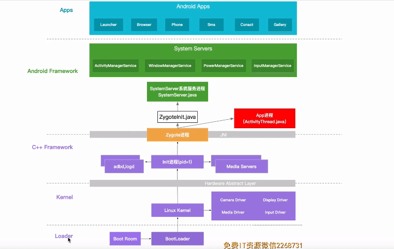

# 安卓系统启动到Service创建

大体流程如图所示，由BootLoader引导开机 依次进入Linux Kernel，C++ Framework, Android Framework, 最后到App层启动App。

## Loader层

Loader层，在长按电源键时，主板通电。主板会引导芯片执行存储器烧录好的预设代码，加载程序到内存中。作用：内存检查，参数初始化。

## Kernel层

Loader层走完后就会进入 kernel层。该层主要会加载一些硬件驱动。在该层与上衣层中间会有一个硬件抽象层（HardWare Abstract Layer）。该层会给上层提供统一的硬件API。

## C++ FrameWork层

进入C++层，系统会开始创建第一个用户进程（init进程）。此外还会孵化出adbd 进程， logdd进程。init进程执行完还会孵化出第一个java进程（Zygote进程）。java进程会调用ZygoteInit这个类。

## Android FrameWork层

ZygoteInit类会创建SystemServer系统服务进程。