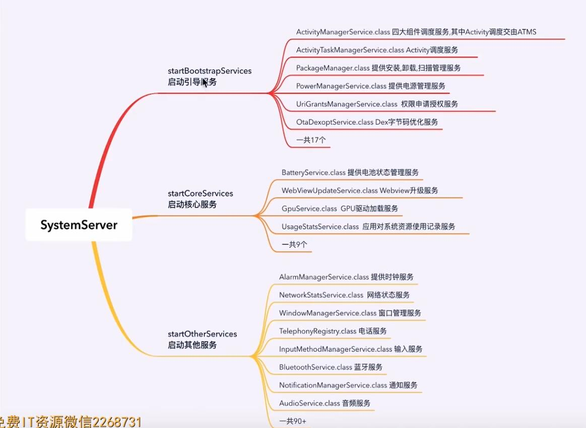
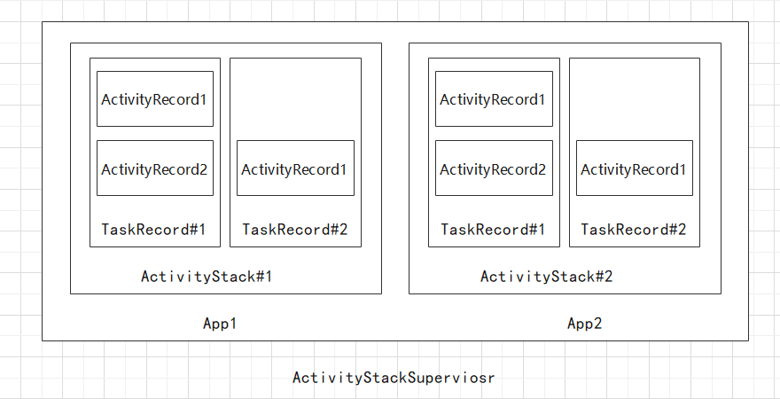

# 安卓系统启动流程

## 通电开机流程

大体流程如图所示，由BootLoader引导开机 依次进入Linux Kernel，C++ Framework, Android Framework, 最后到App层启动App。


### Loader层

Loader层，在长按电源键时，主板通电。主板会引导芯片执行存储器烧录好的预设代码，加载程序到内存中。作用：内存检查，参数初始化。

### Kernel层

Loader层走完后就会进入 kernel层。该层主要会加载一些硬件驱动。在该层与上衣层中间会有一个硬件抽象层（HardWare Abstract Layer）。该层会给上层提供统一的硬件API。

### C++ FrameWork层

进入C++层，系统会开始创建第一个用户进程（init进程）。此外还会孵化出adbd 进程， logdd进程。init进程执行完还会孵化出第一个java进程（Zygote进程）。java进程会调用ZygoteInit这个类。

````
PS C代码调用Java代码流程
1、从classpath路径下搜索类，并返回类对象

2、获取类的默认构造方法ID

3、创建该类的实例

4、查找实例方法的id

5、调用对象的实例方法
````

### Android FrameWork层

ZygoteInit类会创建SystemServer系统服务进程。创建成功后，在SystemServer.java类的入口方法中会创建许许多多的Service（ActivityManagerService,WindowManagerService,PowerManagerService...） 

```
ZygoteInit类 main方法

1、预加载类、预加载资源、预加载动态库

2、启动system_server进程（核心进程）

3、创建Socket服务（该服务接受来自AMS的进程创建请求）

4、进入阻塞状态，处理来自AMS的申请进程创建请求

SystemServer类 main方法

1、创建系统服务的管理者

2、启动引导服务

3、启动核心服务

4、启动一般的服务(startOtherServices 的最后会调用lockSettings.systemReady(); 通知activityManager启动第三方应用)

```


### Apps 层

在创建完了一系列的就开始启动我们的Launcher App

## Launcher 应用启动流程

Launcher的启动流程涉及如下几个核心类

| __类名__ | __作用__ |
|-----|-----|
|ActivityManagerService|Activity生命周期服务的调度类，launcher应用启动入口|
|ActivityTaskManagerService|原AMS中Activity的管理工作|
|RootActivityContainer|查询已安装的所有应用，查找符合Lancher标准的应用|
|ActivityStarter|启动器，进行启动前的各项检查|
|ActivityRecord|记录Activity的所有信息|
|TaskRecord|任务栈，记录一个或多个Activity实例|
|ActivityStack|任务栈的管理者角色|
|ActivityStackSuperviosr|管理ActivityStack实例|
|ProcessList|原AMS中的进程启动工作|
|ZygoteProcess|建立和Zygote进程的Socket链接，把创建进程的参数传入|

ActivityRecord、TaskRecord、ActivityStack、ActivityStackSuperviosr的关系如图所示

