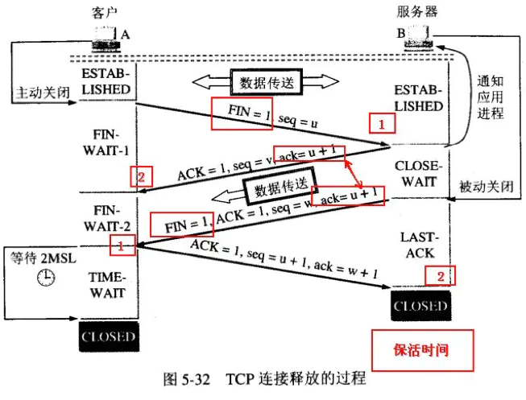

### Q:五层协议的体系结构分别是什么？

* 物理层
* 数据链路层（逻辑链路控制协议、媒体接入控制协议）
* 网络层（IP协议，地址解析协议ARP，逆地址解析协议RARP，因特网控制报文协议）：TCPIP协议的核心，功能是把分组发往目标网络或主机。
* 传输层（UDP、TCP）：功能是使得源端主机和对端主机上的对等实体可以进行会话
* 应用层（文件传输协议FTP，远程登陆协议TELNET，超文本传输协议HTTP，域名系统DNS，简单邮件协议SMTP，简单网络管理协议SNMP）：向应用提供常用的应用程序比如电子邮件、文件传输访问、远程登录等。远程登
录 TELNET 使用 TELNET 协议提供在网络其它主机上注册的接口。TELNET 会话提供了基于字
符的虚拟终端。文件传输访问 FTP 使用 FTP 协议来提供网络内机器间的文件拷贝功能。应用
层面向不同的网络应用引入了不同的应用层协议。其中，有基于 TCP 协议的，如文件传输协
议（File Transfer Protocol，FTP）、虚拟终端协议（TELNET）、超文本链接协议（Hyper Text Transfer
Protocol，HTTP），也有基于 UDP

### Q:为什么有mac地址还要有ip地址

每台主机在出厂时都有一个mac地址。但ip地址的分配呢却是根据网络的拓扑结构，得以保证路由的选择方案建立在网络所在的拓扑位置而不是设备制造商的基础上。

使用ip地址更方便数据传输。数据包在节点中的移动都是由arp负责将ip地址映射到mac地址上。

### Q：TCP与UDP的区别

* TCP：面向连接的全双工可靠通信；提供可靠的服务，无差错、不丢失、不重复且按序到达；具备拥塞控制、流量控制、超时重发、丢弃重复数据等等可靠性检测手段。面向字节流、1对1。

* UDP：无连接，使用不可靠信道；尽最大的努力交付，就是交付不了也没辙的意思;面向报文、支持1对1、1对多、多对1的交互通信。

### Q：拥塞控制和流量控制是什么

* 拥塞控制：对网络中的路由和链路传输进行速度限制，避免网络过载；有慢启动、拥塞避免、快重传、快恢复

* 流量控制：对点和点/发送方和接收方之间的速度匹配，由于接收方的应用程序读取速度不是很快不一定迅速，加上缓存有限，因此需要双方约定好控制好流量。相关技术TCP滑动窗口、回退n针协议。

### Q：为什么要三次握手、四次挥手

* 先讲三次握手是什么

三次握手是客户端发起表示连接的syn报文段，服务器收到后，回复表示同意连接的报文段ack给客户端。客户端收到后需要再回一个ack表示确认。至此才能建立起连接。

* 三次握手作用

三次握手可以避免由于客户端的请求连接的请求延迟导致的无故多次建立连接

* 四次挥手是什么

如图

* 为什么需要四次挥手

因为TCP大爷是全双工通信，两个方向需要单独关闭。客户端发送fin，服务端收到回个ack，这个过程结束的是客户端到服务端连接，而服务端到客户端还有连接，服务端发送fin然后客户端收到服务端的fin回一个ack这里。这时才真正结束。

### Http响应状态码

Http状态码分为5大类

* 1xx ：表示临时响应并需要请求者继续执行操作的状态码

    100 ： 请求者应当继续提出请求，服务器返回此代码表示已经收到了一部分，正在等其余部分

    101 ： 请求者要求切换协议，服务端已经确认并准备切换。

* 2xx ： 表示成功处理了请求的状态码

* 3xx : 表示服务端资源重定向，需要客户端进一步操作

* 4xx ： 表示客户端请求非法

    400 ： 语法错误
    
    401 :  未经授权
    
    403 ： 表示收到请求但拒绝提供服务，通常会给出原因

    404 ： 页面不存在

* 5xx : 表示服务器未能正常处理客户端的请求而出现意外。

    500 ： 表示存在不可预期的错误

    503 ： 表示服务器当前不能处理客户端请求，但一段时间可能会恢复

### POST GET的区别

GET的含义是请求从服务器获取资源；参数通过URL传递；长度有限制；不能传递敏感信息；安全且幂等，不会破坏服务器资源，多次相同请求结果相等。

POST的用处则是向指定URL提交数据，数据放置在body中；因为提交的数据会修改服务器数据所以是非安全不具备幂等性。

### Http1.0、1.1、2.0之间的区别

1.0 -> 1.1

开始修改默认连接方式 短连接变长连接。

增加了新的状态码、请求头、响应头扩充功能（缓存管理、状态管理...）

1.1 -> 2.0

修改纯文本报文为二进制格式，，头信息和数据体都是二进制，并且统称为帧（frame）

多路复用：连接共享，即每一个request都是是用作连接共享机制的

增加服务器推送

多个请求的头部相同时会压缩头部，消除重复部分。

