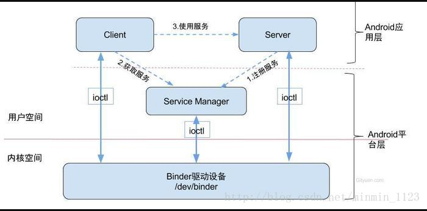
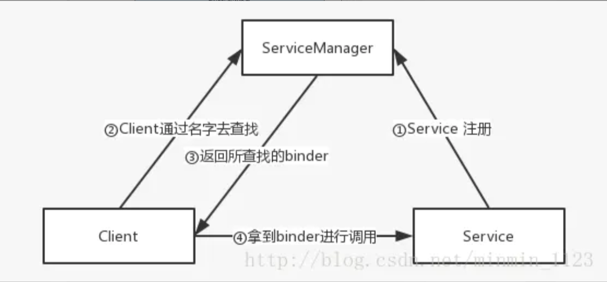

# 安卓基础

## Activty

### Activty生命周期
* onCreate()表示Activity 正在创建，常做初始化工作，如setContentView界面资源、初始化数据
* onStart()表示Activity 正在启动，这时Activity 可见但不在前台，无法和用户交互
* onResume()表示Activity 获得焦点，此时Activity 可见且在前台并开始活动
* onPause()表示Activity 正在停止，可做 数据存储、停止动画等操作
* onStop()表示activity 即将停止，可做稍微重量级回收工作，如取消网络连接、注销广播接收器等
* onDestroy()表示Activity 即将销毁，常做回收工作、资源释放
另外，当Activity由后台切换到前台，由不可见到可见时会调用onRestart()，表示Activity 重新启动

### onStart()和onResume()/onPause()和onStop()的区别？

onStart()与onStop()是从Activity是否可见这个角度调用的，onResume()和onPause()是从Activity是否显示在前台这个角度来回调的，在实际用中差别不大。注意当有Activity做的弹窗出现时，会调用onPause() 而不会 onStop()

### Activity A启动另一个Activity B会回调哪些方法？如果Activity B是完全透明呢？如果启动的是一个对话框Activity呢？

Activity A启动另一个Activity B会回调的方法：Activity A的onPause() -->Activity B的onCreate()-->onStart()-->onResume()-->Activity A的onStop()；如果Activity B是完全透明的，则最后不会调用Activity A的onStop()；如果是对话框Activity，同后种情况。

### 谈谈onSaveInstanceState()方法？何时会调用？

当非人为终止Activity时，比如系统配置发生改变、横竖屏切换时导致Activity被杀死并重新创建、资源内存不足导致低优先级的Activity被杀死，会调用 onSavaInstanceState() 来保存状态。该方法调用在onStop之前，但与onPause没有时序关系。

### onSaveInstanceState()与onPause()的区别？

onSaveInstanceState()适用于对临时性状态的保存，而onPause()适用于对数据的持久化保存。

### 如何避免配置改变时Activity重建？

指定configChanges属性，重写onConfigurationChanged方法即可。

### 优先级低的Activity在内存不足被回收后怎样做可以恢复到销毁前状态？

先级低的Activity在内存不足被回收后重新打开会引发Activity重建。Activity被重新创建时会调用onRestoreInstanceState（该方法在onStart之后），并将onSavaInstanceState保存的Bundle对象作为参数传到onRestoreInstanceState与onCreate方法。因此可通过onRestoreInstanceState(Bundle savedInstanceState)和onCreate((Bundle savedInstanceState)来判断Activity是否被重建，并取出数据进行恢复。但需要注意的是，在onCreate取出数据时一定要先判断savedInstanceState是否为空。另外，谷歌更推荐使用onRestoreInstanceState进行数据恢复。

### 说下Activity的四种启动模式？

* standard标准模式：每次启动一个Activity就会创建一个新的实例
* singleTop栈顶复用模式：如果新Activity已经位于任务栈的栈顶，就不会重新创建，并回调 onNewIntent(intent) 方法。常用于防止重复点击。
* singleTask栈内复用模式：只要该Activity在一个任务栈中存在，都不会重新创建，并回调 onNewIntent(intent) 方法。如果不存在，系统会先寻找是否存在需要的栈，如果不存在该栈，就创建一个任务栈，并把该Activity放进去；如果存在，就会创建到已经存在的栈中。常用于主页
* singleInstance单实例模式：具有此模式的Activity只能单独位于一个任务栈中，且此任务栈中只有唯一一个实例。可以用作闹钟等应用。

### Activity的启动过程？

调用startActivity()后经过重重方法会转移到ActivityManagerService的startActivity()，并通过一个IPC回到ActivityThread的内部类ApplicationThread中，并调用其scheduleLaunchActivity()将启动Activity的消息发送并交由Handler H处理。Handler H对消息的处理会调用handleLaunchActivity()->performLaunchActivity()得以完成Activity对象的创建和启动。

## Fragment

### 谈一谈Fragment的生命周期？

onAttach()->onCreate()-> onCreateView()->onActivityCreated()->onStart()->onResume()->onPause()->onStop()->onDestroyView()->onDestroy()->onDetach()

* onAttach()：当Fragment和Activity建立关联时调用
* onCreateView()：当Fragment创建视图时调用
* onActivityCreated()：当与Fragment相关联的Activity完成onCreate()之后调用
* onDestroyView()：在Fragment中的布局被移除时调用
* onDetach()：当Fragment和Activity解除关联时调用

### Activity和Fragment的异同？

* Activity和Fragment的相似点在于，它们都可包含布局、可有自己的生命周期，Fragment可看似迷你活动。
* 不同点是，由于Fragment是依附在Activity上的，多了些和宿主Activity相关的生命周期方法，如onAttach()、onActivityCreated()、onDetach()；另外，Fragment的生命周期方法是由宿主Activity而不是操作系统调用的，Activity中生命周期方法都是protected，而Fragment都是public，也能印证了这一点，因为Activity需要调用Fragment那些方法并管理它。

### Activity和Fragment的关系？

* 正如Fragment的名字“碎片”，它的出现是为了解决Android碎片化 ，它可作为Activity界面的组成部分，可在Activity运行中实现动态地加入、移除和交换。
* 一个Activity中可同时出现多个Fragment，一个Fragment也可在多个Activity中使用。
* 另外，Activity的FragmentManager负责调用队列中Fragment的生命周期方法，只要Fragment的状态与Activity的状态保持了同步，宿主Activity的FragmentManager便会继续调用其他生命周期方法以继续保持Fragment与Activity的状态一致。

### 何时会考虑使用Fragment?

非常经典的例子，即用两个Fragment封装两个界面模块，这样只使一套代码就能适配两种设备，达到两种界面效果；单一场景切换时使用Fragment更轻量化，如ViewPager和Fragment搭配使用在主页做tab

## Service

### 谈一谈Service的生命周期？

* onCreate（）：服务第一次被创建时调用
* onStartComand（）：服务启动时调用
* onBind（）：服务被绑定时调用
* onUnBind（）：服务被解绑时调用
* onDestroy（）：服务停止时调用

### Service的两种启动方式？区别在哪？

* 第一种，其他组件调用Context的 startService() 方法可以启动一个Service，并回调服务中的onStartCommand()。如果该服务之前还没创建，那么回调的顺序是onCreate()->onStartCommand()。服务启动了之后会一直保持运行状态，直到 stopService() 或 stopSelf() 方法被调用，服务停止并回调onDestroy()。另外，无论调用多少次startService()方法，只需调用一次stopService()或stopSelf()方法，服务就会停止了。

* 第二种，，其它组件调用Context的 bindService() 可以绑定一个Service，并回调服务中的onBind()方法。类似地，如果该服务之前还没创建，那么回调的顺序是onCreate()->onBind()。之后，调用方可以获取到onBind()方法里返回的IBinder对象的实例，从而实现和服务进行通信。只要调用方和服务之间的连接没有断开，服务就会一直保持运行状态，直到调用了 unbindService() 方法服务会停止，回调顺序onUnBind()->onDestroy()。

### 一个Activty先start一个Service后，再bind时会回调什么方法？此时如何做才能回调Service的destory()方法？

startService()启动Service之后，再bindService()绑定，此时只会回调onBind()方法；若想回调Service的destory()方法，需要同时调用 stopService()和 unbindService()方法才能让服务销毁掉。

### 是否能在Service进行耗时操作？如果非要可以怎么做？

不行，Service默认不会运行在子线程中，也不会运行在一个独立的线程中，它同样执行在主线程中。所以万万不可以做耗时操作

### 前台服务是什么？和普通服务的不同？如何去开启一个前台服务？

和一般运行在后台的服务不同，前台服务的服务状态可以被用户一眼看到。它和普通服务最大的区别是，前者会一直有一个正在运行的图标在系统的状态栏显示，下拉状态栏后可以看到更加详细的信息，非常类似于通知的效果，且当系统内存不足服务被杀死时，通知会被移除。实现一个前台服务也非常简单，和发送一个通知非常类似，只不过在构建好一个Notification之后，不需要NotificationManager将通知显示出来，而是调用了 startForeground() 方法。

### 如何保证Service不被杀死？

* Service的onStartCommand()中设置flags值为START_STICKY，使得Service被杀后尝试再次启动Service。
* 提升优先级，更改为前台服务。
* 发送广播。在广播接收器中启动服务。

##  广播

### 广播分类

* 普通广播：一种完全异步的广播。同一时刻多个接收器可以同时接收，广播发出后广播接收器会随机接收到广播消息，没有优先级。
* 有序广播：一种同步执行的广播，同一时刻只有一个广播接收器接收，一个接收器处理完才给下一个。中间有可能被拦截。
* 本地广播：发出的广播只能在应用程序内部传递，只能接收本地广播接收器发出的广播。不能跨进程
* 粘性广播：这种广播会一直滞留，当有匹配该广播的接收器被注册后，该接收器就会收到此条广播。

### 广播的两种注册形式？区别在哪里

广播的注册形式有两种，一种是动态代码注册，一种是静态的在清单文件里注册。最大的区别是静态注册接收器，程序未启动也可以接收，而动态注册的则是必须程序启动，且相关代码被调用。

## ContentProvider

### ContentProvider了解多少？

作为四大组件之一，ContentProvider主要负责存储和共享数据。与文件存储、SharedPreferences存储、SQLite数据库存储这几种数据存储方法不同的是，后者保存下的数据只能被该应用程序使用，而前者可以让不同应用程序之间进行数据共享，它还可以选择只对哪一部分数据进行共享，从而保证程序中的隐私数据不会有泄漏风险。

### Android中提供哪些数据持久存储的方法？

* File文件存储：写入和读取文件的方法和java中的io程序一样。
* SharePreference存储：利用xml文件进行一些简单数据的存储
* SQLite：一款轻量级的关系型数据库，它的运算速度非常快，占用资源很少
* ContentProvider：四大组件之一，用于数据的存储和分享。可跨进程

## IPC

### Android中进程和线程的关系？

* 进程是资源调度的基本单位
* 线程是cpu调度的基本单位

### 什么是序列化？Serializable接口和Parcelable接口的区别？为何推荐使用后者？

序列化表示将一个对象转换成可存储或可传输的状态。序列化后的对象可以在网络上进行传输，也可以存储到本地

* Serializable ：java的序列化接口。使用简单，开销大。适合将对象序列化后通过网络设备传输
* Parcelable ： android的序列化皆苦。高效，但使用麻烦。主要用于内存的序列化

### Android中为何新增Binder来作为主要的IPC方式？

* 效率更高，相比于其他linux的跨进程传输，binder通过内存映射的方式，只需要将数据复制一次就可以进行进程间的一个通信。
* 实现C/S架构方便，基于CS架构，所以C端 S端 相对独立，稳定性好。
* 安全性高，Binder机制为每个进程分配了UID、PID。通信时会对这些进行有效性检测

### Binder框架

Binder框架有四个角色。Server,Client,ServiceManager和Binder驱动。其中Server，Client，ServiceManger运行于用户空间，Binder驱动运行于内核空间。

Server&Client: 服务器&客户端。在Binder驱动和Service Manager提供的基础设施上，进行Client-Server之间的通信。

ServiceManger 服务的管理者，将Binder名字转换成为Client中对该Binder的引用，使得Client可以通过Binder名字获得Server中Binder实体的引用。

Binder驱动

* 与硬件设备没有关系，其工作方式与设备驱动程序是一样的，工作于内核态。
* 提供open()、mmap()、poll()、ioctl() 等标准文件操作。
* 以字符驱动设备中的misc设备注册在设备目录/dev下，用户通过/dev/binder访问该它。
* 负责进程之间binder通信的建立，传递，计数管理以及数据的传递交互等底层支持。
* 驱动和应用程序之间定义了一套接口协议，主要功能由ioctl() 接口实现，由于ioctl()灵活、方便且能够一次调用实现先写后读以满足同步交互，因此不必分别调用write()和read()接口。
* 其代码位于linux目录的drivers/misc/binder.c中。

## View

### MotionEvent是什么？包含几种事件？什么条件下会产生？

ACTION_DOWN：手指刚接触屏幕
ACTION_MOVE：手指在屏幕上滑动
ACTION_UP：手指在屏幕上松开的一瞬间
ACTION_CANCEL：手指保持按下操作，并从当前控件转移到外层控件时会触发

### scrollTo()和scrollBy()的区别？

scrollBy内部调用了scrollTo，它是基于当前位置的相对滑动；而scrollTo是绝对滑动，因此如果利用相同输入参数多次调用scrollTo()方法，由于View初始位置是不变只会出现一次View滚动的效果而不是多次。
