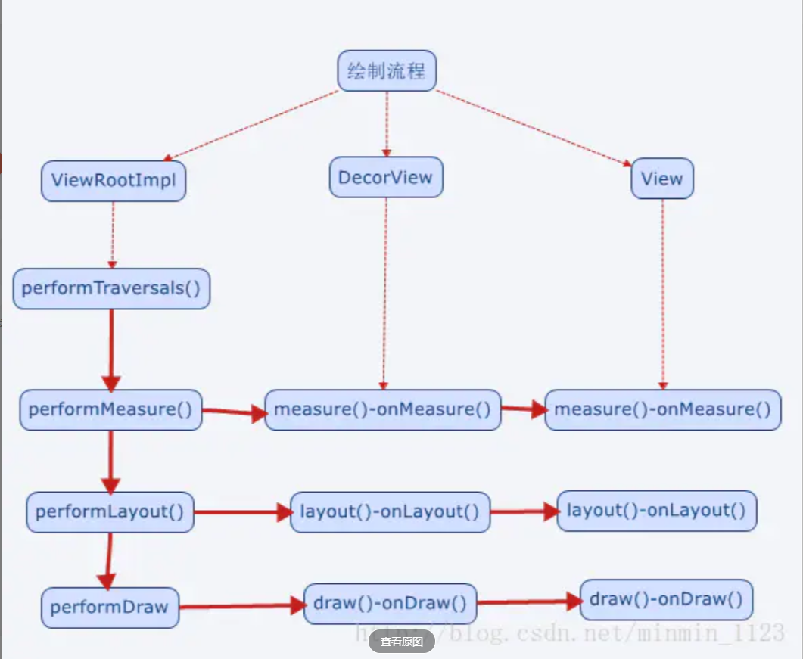

# 安卓基础

## Activty

### Activty生命周期
* onCreate()表示Activity 正在创建，常做初始化工作，如setContentView界面资源、初始化数据
* onStart()表示Activity 正在启动，这时Activity 可见但不在前台，无法和用户交互
* onResume()表示Activity 获得焦点，此时Activity 可见且在前台并开始活动
* onPause()表示Activity 正在停止，可做 数据存储、停止动画等操作
* onStop()表示activity 即将停止，可做稍微重量级回收工作，如取消网络连接、注销广播接收器等
* onDestroy()表示Activity 即将销毁，常做回收工作、资源释放
另外，当Activity由后台切换到前台，由不可见到可见时会调用onRestart()，表示Activity 重新启动

### onStart()和onResume()/onPause()和onStop()的区别？

onStart()与onStop()是从Activity是否可见这个角度调用的，onResume()和onPause()是从Activity是否显示在前台这个角度来回调的，在实际用中差别不大。注意当有Activity做的弹窗出现时，会调用onPause() 而不会 onStop()

### Activity A启动另一个Activity B会回调哪些方法？如果Activity B是完全透明呢？如果启动的是一个对话框Activity呢？

Activity A启动另一个Activity B会回调的方法：Activity A的onPause() -->Activity B的onCreate()-->onStart()-->onResume()-->Activity A的onStop()；如果Activity B是完全透明的，则最后不会调用Activity A的onStop()；如果是对话框Activity，同后种情况。

### 谈谈onSaveInstanceState()方法？何时会调用？

当非人为终止Activity时，比如系统配置发生改变、横竖屏切换时导致Activity被杀死并重新创建、资源内存不足导致低优先级的Activity被杀死，会调用 onSavaInstanceState() 来保存状态。该方法调用在onStop之前，但与onPause没有时序关系。

### onSaveInstanceState()与onPause()的区别？

onSaveInstanceState()适用于对临时性状态的保存，而onPause()适用于对数据的持久化保存。

### 如何避免配置改变时Activity重建？

指定configChanges属性，重写onConfigurationChanged方法即可。

### 优先级低的Activity在内存不足被回收后怎样做可以恢复到销毁前状态？

先级低的Activity在内存不足被回收后重新打开会引发Activity重建。Activity被重新创建时会调用onRestoreInstanceState（该方法在onStart之后），并将onSavaInstanceState保存的Bundle对象作为参数传到onRestoreInstanceState与onCreate方法。因此可通过onRestoreInstanceState(Bundle savedInstanceState)和onCreate((Bundle savedInstanceState)来判断Activity是否被重建，并取出数据进行恢复。但需要注意的是，在onCreate取出数据时一定要先判断savedInstanceState是否为空。另外，谷歌更推荐使用onRestoreInstanceState进行数据恢复。

### 说下Activity的四种启动模式？

* standard标准模式：每次启动一个Activity就会创建一个新的实例
* singleTop栈顶复用模式：如果新Activity已经位于任务栈的栈顶，就不会重新创建，并回调 onNewIntent(intent) 方法。常用于防止重复点击。
* singleTask栈内复用模式：只要该Activity在一个任务栈中存在，都不会重新创建，并回调 onNewIntent(intent) 方法。如果不存在，系统会先寻找是否存在需要的栈，如果不存在该栈，就创建一个任务栈，并把该Activity放进去；如果存在，就会创建到已经存在的栈中。常用于主页
* singleInstance单实例模式：具有此模式的Activity只能单独位于一个任务栈中，且此任务栈中只有唯一一个实例。可以用作闹钟等应用。

### Activity的启动过程？

调用startActivity()后经过重重方法会转移到ActivityManagerService的startActivity()，并通过一个IPC回到ActivityThread的内部类ApplicationThread中，并调用其scheduleLaunchActivity()将启动Activity的消息发送并交由Handler H处理。Handler H对消息的处理会调用handleLaunchActivity()->performLaunchActivity()得以完成Activity对象的创建和启动。

## Fragment

### 谈一谈Fragment的生命周期？

onAttach()->onCreate()-> onCreateView()->onActivityCreated()->onStart()->onResume()->onPause()->onStop()->onDestroyView()->onDestroy()->onDetach()

* onAttach()：当Fragment和Activity建立关联时调用
* onCreateView()：当Fragment创建视图时调用
* onActivityCreated()：当与Fragment相关联的Activity完成onCreate()之后调用
* onDestroyView()：在Fragment中的布局被移除时调用
* onDetach()：当Fragment和Activity解除关联时调用

### Activity和Fragment的异同？

* Activity和Fragment的相似点在于，它们都可包含布局、可有自己的生命周期，Fragment可看似迷你活动。
* 不同点是，由于Fragment是依附在Activity上的，多了些和宿主Activity相关的生命周期方法，如onAttach()、onActivityCreated()、onDetach()；另外，Fragment的生命周期方法是由宿主Activity而不是操作系统调用的，Activity中生命周期方法都是protected，而Fragment都是public，也能印证了这一点，因为Activity需要调用Fragment那些方法并管理它。

### Activity和Fragment的关系？

* 正如Fragment的名字“碎片”，它的出现是为了解决Android碎片化 ，它可作为Activity界面的组成部分，可在Activity运行中实现动态地加入、移除和交换。
* 一个Activity中可同时出现多个Fragment，一个Fragment也可在多个Activity中使用。
* 另外，Activity的FragmentManager负责调用队列中Fragment的生命周期方法，只要Fragment的状态与Activity的状态保持了同步，宿主Activity的FragmentManager便会继续调用其他生命周期方法以继续保持Fragment与Activity的状态一致。

### 何时会考虑使用Fragment?

非常经典的例子，即用两个Fragment封装两个界面模块，这样只使一套代码就能适配两种设备，达到两种界面效果；单一场景切换时使用Fragment更轻量化，如ViewPager和Fragment搭配使用在主页做tab

## Service

### 谈一谈Service的生命周期？

* onCreate（）：服务第一次被创建时调用
* onStartComand（）：服务启动时调用
* onBind（）：服务被绑定时调用
* onUnBind（）：服务被解绑时调用
* onDestroy（）：服务停止时调用

### Service的两种启动方式？区别在哪？

* 第一种，其他组件调用Context的 startService() 方法可以启动一个Service，并回调服务中的onStartCommand()。如果该服务之前还没创建，那么回调的顺序是onCreate()->onStartCommand()。服务启动了之后会一直保持运行状态，直到 stopService() 或 stopSelf() 方法被调用，服务停止并回调onDestroy()。另外，无论调用多少次startService()方法，只需调用一次stopService()或stopSelf()方法，服务就会停止了。

* 第二种，，其它组件调用Context的 bindService() 可以绑定一个Service，并回调服务中的onBind()方法。类似地，如果该服务之前还没创建，那么回调的顺序是onCreate()->onBind()。之后，调用方可以获取到onBind()方法里返回的IBinder对象的实例，从而实现和服务进行通信。只要调用方和服务之间的连接没有断开，服务就会一直保持运行状态，直到调用了 unbindService() 方法服务会停止，回调顺序onUnBind()->onDestroy()。

### 一个Activty先start一个Service后，再bind时会回调什么方法？此时如何做才能回调Service的destory()方法？

startService()启动Service之后，再bindService()绑定，此时只会回调onBind()方法；若想回调Service的destory()方法，需要同时调用 stopService()和 unbindService()方法才能让服务销毁掉。

### 是否能在Service进行耗时操作？如果非要可以怎么做？

不行，Service默认不会运行在子线程中，也不会运行在一个独立的线程中，它同样执行在主线程中。所以万万不可以做耗时操作

### 前台服务是什么？和普通服务的不同？如何去开启一个前台服务？

和一般运行在后台的服务不同，前台服务的服务状态可以被用户一眼看到。它和普通服务最大的区别是，前者会一直有一个正在运行的图标在系统的状态栏显示，下拉状态栏后可以看到更加详细的信息，非常类似于通知的效果，且当系统内存不足服务被杀死时，通知会被移除。实现一个前台服务也非常简单，和发送一个通知非常类似，只不过在构建好一个Notification之后，不需要NotificationManager将通知显示出来，而是调用了 startForeground() 方法。

### 如何保证Service不被杀死？

* Service的onStartCommand()中设置flags值为START_STICKY，使得Service被杀后尝试再次启动Service。
* 提升优先级，更改为前台服务。
* 发送广播。在广播接收器中启动服务。

##  广播

### 广播分类

* 普通广播：一种完全异步的广播。同一时刻多个接收器可以同时接收，广播发出后广播接收器会随机接收到广播消息，没有优先级。
* 有序广播：一种同步执行的广播，同一时刻只有一个广播接收器接收，一个接收器处理完才给下一个。中间有可能被拦截。
* 本地广播：发出的广播只能在应用程序内部传递，只能接收本地广播接收器发出的广播。不能跨进程
* 粘性广播：这种广播会一直滞留，当有匹配该广播的接收器被注册后，该接收器就会收到此条广播。

### 广播的两种注册形式？区别在哪里

广播的注册形式有两种，一种是动态代码注册，一种是静态的在清单文件里注册。最大的区别是静态注册接收器，程序未启动也可以接收，而动态注册的则是必须程序启动，且相关代码被调用。

## ContentProvider

### ContentProvider了解多少？

作为四大组件之一，ContentProvider主要负责存储和共享数据。与文件存储、SharedPreferences存储、SQLite数据库存储这几种数据存储方法不同的是，后者保存下的数据只能被该应用程序使用，而前者可以让不同应用程序之间进行数据共享，它还可以选择只对哪一部分数据进行共享，从而保证程序中的隐私数据不会有泄漏风险。

### Android中提供哪些数据持久存储的方法？

* File文件存储：写入和读取文件的方法和java中的io程序一样。
* SharePreference存储：利用xml文件进行一些简单数据的存储
* SQLite：一款轻量级的关系型数据库，它的运算速度非常快，占用资源很少
* ContentProvider：四大组件之一，用于数据的存储和分享。可跨进程

## IPC

### Android中进程和线程的关系？

* 进程是资源调度的基本单位
* 线程是cpu调度的基本单位

### 多进程的好处

* 突破进程内存的限制（如图库中占用内存过多）
* 功能稳定性（独立的通信进程用以保持连接的稳定性）
* 规避系统的内存泄露风险（独立的WebView进程阻隔内存泄漏导致的问题）
* 隔离风险（不稳定的功能放入独立进程，避免导致主进程崩溃）

### intent传数据限制

1MB-8k，实际传输中比这个小。原因：数据还需要有个打包，类似网络分包的时候有包头、命令。

### 什么是序列化？Serializable接口和Parcelable接口的区别？为何推荐使用后者？

序列化表示将一个对象转换成可存储或可传输的状态。序列化后的对象可以在网络上进行传输，也可以存储到本地

* Serializable ：java的序列化接口。使用简单，开销大。适合将对象序列化后通过网络设备传输
* Parcelable ： android的序列化皆苦。高效，但使用麻烦。主要用于内存的序列化

### Android中为何新增Binder来作为主要的IPC方式？

* 效率更高，相比于其他linux的跨进程传输，binder通过内存映射的方式，只需要将数据复制一次就可以进行进程间的一个通信。
* 实现C/S架构方便，基于CS架构，所以C端 S端 相对独立，稳定性好。
* 安全性高，Binder机制为每个进程分配了UID、PID。通信时会对这些进行有效性检测 

### Binder框架

Binder框架有四个角色。Server,Client,ServiceManager和Binder驱动。其中Server，Client，ServiceManger运行于用户空间，Binder驱动运行于内核空间。

Server&Client: 服务器&客户端。在Binder驱动和Service Manager提供的基础设施上，进行Client-Server之间的通信。

ServiceManger 服务的管理者，将Binder名字转换成为Client中对该Binder的引用，使得Client可以通过Binder名字获得Server中Binder实体的引用。

Binder驱动

* 与硬件设备没有关系，其工作方式与设备驱动程序是一样的，工作于内核态。
* 提供open()、mmap()、poll()、ioctl() 等标准文件操作。
* 以字符驱动设备中的misc设备注册在设备目录/dev下，用户通过/dev/binder访问该它。
* 负责进程之间binder通信的建立，传递，计数管理以及数据的传递交互等底层支持。
* 驱动和应用程序之间定义了一套接口协议，主要功能由ioctl() 接口实现，由于ioctl()灵活、方便且能够一次调用实现先写后读以满足同步交互，因此不必分别调用write()和read()接口。
* 其代码位于linux目录的drivers/misc/binder.c中。

在binder通信的过程中数据的发送方通过copy的方式向内核空间发数据，在收方通过mmap（内存映射）的方式进行。？

#### mmap的原理（mmap）

Linux通过将一个虚拟内存区域与一个磁盘上的对象关联起来，以初始化这个虚拟内存区域的内容，这个过程称为内存映射

## View

### MotionEvent是什么？包含几种事件？什么条件下会产生？

ACTION_DOWN：手指刚接触屏幕
ACTION_MOVE：手指在屏幕上滑动
ACTION_UP：手指在屏幕上松开的一瞬间
ACTION_CANCEL：手指保持按下操作，并从当前控件转移到外层控件时会触发

### scrollTo()和scrollBy()的区别？

scrollBy内部调用了scrollTo，它是基于当前位置的相对滑动；而scrollTo是绝对滑动，因此如果利用相同输入参数多次调用scrollTo()方法，由于View初始位置是不变只会出现一次View滚动的效果而不是多次。

### 谈一谈View的事件分发

事件分发的本质是对MotionEvent事件分发。。传递顺序为Activity->ViewGroup->View;

三个主要方法：

* dispatchTouchEvent：分发事件。返回值是boolean类型，受当前的onTouchEvent和下级dispatchTouchEvent影响。
* onInterceptTouchEvent：对事件进行拦截，这个方法只在ViewGroup中有，View中没有。
* onTouchEvent：处理事件，该事件只在View中。注意ViewGroup的则在其父类View中。

### 谈一谈View的绘制流程？

#### View绘制的大致流程

View的绘制是先measure测量，用于测定View的测量宽高。再layout布局。用于测定四个顶点的位置。最后draw绘制。

ViewRootImpl里有一个类接收到硬件的信号后就会开始整个绘制流程。
整个流程如图所示。

#### MeasureSpec是什么？有什么作用？

作用：通过宽测量值widthMeasureSpec和高测量值heightMeasureSpec决定View的大小

组成：32位的int值。前两位为测试模式，后30位为测量大小。

三种模式：

UNSPECIFIED:父容器不对View有任何限制，要多大有多大。常用于系统内部

EXACTLY：父视图为子视图指定一个确切的尺寸。对应LyaoutParams中的match_parent或具体数值。

AT_MOST：父容器为子视图指定一个最大的尺寸size，对应LayoutParams中的wrap_content

引申：直接继承View的自定义View需要重写onMeasure()并设置wrap_content时的自身大小，否则效果相当于macth_parent

#### View的事件onTouch()、onTouchEvent()和onClick()关系？

优先级 onTouch()>onTouchEvent()>onClick()。因为onTouchListener的onTouch()方法会先触发；onTouch()返回false才会接着触发onTouchEvent()，同样的，内置诸如onClick()事件的实现等等都基于onTouchEvent()；如果onTouch()返回true，这些事件将不会被触发。

### 谈谈Handler机制

#### 为什么主线程不会因为Looper.loop()里的死循环卡死？

主线程确实是通过Looper.loop()进入了循环状态。因为只有这样主线程才不会像其他线程一样执行完就退出了。

在主线程的MessageQueue没有消息时，便会阻塞住，具体阻塞方法是nativePollOnce()。这个时候主线程就会释放CPU资源，直到新的消息到达。

这里底层原理采用的epoll机制。是一种IO多路复用，可以同时监控多个文件描述符，当某个描述符就绪，就会通知程序相应程序进行操作！进而唤醒线程。

#### post和sendMessage的区别

post一类方法发的消息是Runnable对象，但最后呢也会封装成Message对象，将Runnable对象赋值给Message对象中的callback变量，然后交由sendMessageAtTime()方法发送出去，在处理消息时，会在dispatchMessage()方法里被handleCallback(msg)方法执行。实际执行的是run方法。

send消息一般发送都是Message对象，处理消息时，优先级低于post。通过自己写的handleMessage方法执行。

#### 为什么要通过Message.obtain()方法获取Message对象

这个方法可以从全局消息池冲获得一个空的Message对象。可以节省系统资源。同时通过各种方法得到Message的拷贝，或者对Message进行一些初始化。

#### Handler实现发送延迟消息的原理是什么？

我们常用postDelay()和sendMessageDelay() 来发送延迟消息，其实最终都是将延迟时间转为确定时间，然后通过sendMessageAtTIme()的时候将消息插入MessageQuenue。当当前时间没有到发送需要的时间的时候就会阻塞线程。直到等到消息的执行时间再执行。

#### 同步屏障SyncBarrier是什么？有什么作用?

在一般情况下，同步消息和异步消息没有什么不同。只是设置了同步屏障后才会有差异。同步屏障从代码层看是一个Message对象，但其target是空，用来区分普通消息，在消息处理时如果遇到同步屏障就会跳过同步消息去执行异步消息。不过这个开发者用不了。在ViewRootImpl的UI测绘流程中有体现。

#### IdleHandler是什么，有什么作用？

当消息队列没有消息调用或者如果队列中有消息，但没有到时间的时候。也会调用这个方法。用以监听主线程的空闲状态。

#### 为什么非静态类的Handler导致内存泄漏？如何解决？

首先，非静态的内部类中会默认持有外部类的引用。也就是说在Activity中创建的Handler会因此持有Activity的引用。

当我们在主线程中使用Handler时，Hanlder会默认绑定现有线程的Looper对象，并关联messageQueue,发送的消息都会到MessageQueue中。而我们的Looper的生命周期贯穿主线程。所以当我们的Looper对象中的MessageQueue中还有未处理的Message时。Message持有Handler引用，handler持有Activty。所以泄露了

#### 多个线程往MessageQueue中添加消息，是如何保持线程安全的。

源码在添加消息和取消息的时候都会添加synchronizaed的关键字，而因为我们加了锁。所以我们在handler delay消息的时候时间是不准确的。
（）

#### 如何让在子线程中弹出Tosat

调用Looper.prepare 以及 Looper.loop()，但是切记线程切换任务执行完，需要手动调用Looper.quitSafely()。线程不会结束。

#### ThreadLocal的作用

实现线程的本地存储功能，把共享数据的可见范围限制在线程之内。帮助Handler找到本线程的Looper

底层的数据结构：每个线程的Thread对象中都有一个ThreadLocalMap对象，它存储了一组以ThreadLocal.threadLocalHashCode为key、以本地线程变量为value的键值对。我们的ThreadLocal就是当前ThreadLocalMap的访问入口。包含了独一无二的threadLocalHashCode值，通过这个值就可以在线程键值对中找到相应的本地线程变量。

### Activity中的异步方式

#### Android中还了解哪些方便线程切换的类

安卓中有对Handler进一步封装的几个类。

* AsyncTask:底层封装了线程池和Handler，便于执行后台任务以及子线程中进行UI操作。

* HandlerThread: 一种具有消息循环的线程。

* IntentService：是一种异步、会自动停止的服务，内部采用HandlerThread

#### AsyncTask相比Handler有什么优点？不足呢？

Handler机制存在的问题：多线程同时执行时不易精确控制线程。。

引入AsyncTask的好处：创建异步任务更简单，直接继承就可以方便的实现任务执行和进度回调。无需编写任务线程和Handler实例就能完成相同的任务。

#### AsyncTask中使用的线程池大小？

SerialExecutor：用于任务的排队，默认是串行的线程池，在3.0以前核心线程数为5、线程池大小为128，而3.0以后变为同一时间只能处理一个任务

THREAD_POOL_EXECUTOR：用于真正执行任务。

#### HandlerThread有什么特点？

HandlerThread是一个线程类，它继承自Thread。与普通Thread不同，HandlerThread具有消息循环的效果，这是因为它内部HandlerThread.run()方法中有Looper，能通过Looper.prepare()来创建消息队列，并通过Looper.loop()来开启消息循环。

### Activity、View、Window三者之间的关系？

Activity的启动过程中初始化了PhoneWindow。PhoneWindow是Window的唯一实现类，然后Activity通过setContentView将View设置到了PhoneWindow上，而View通过WindowManager的addView()、removeView()、updateViewLayout()对View进行管理。